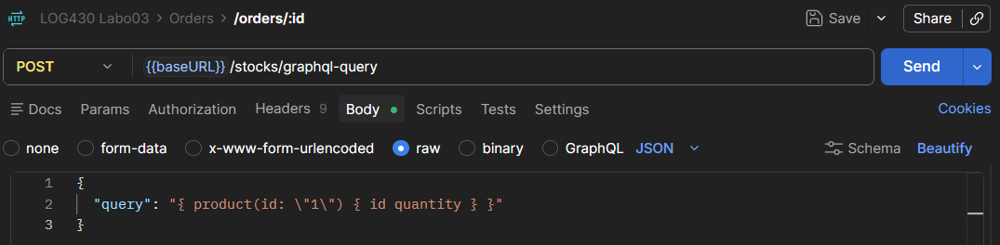
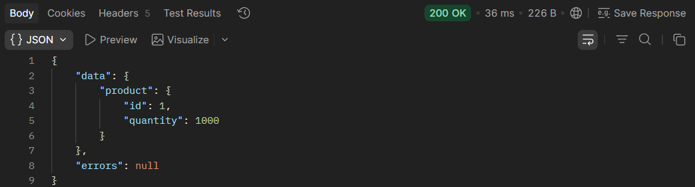
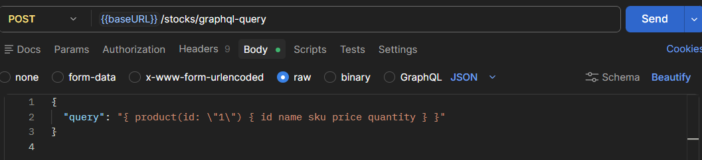
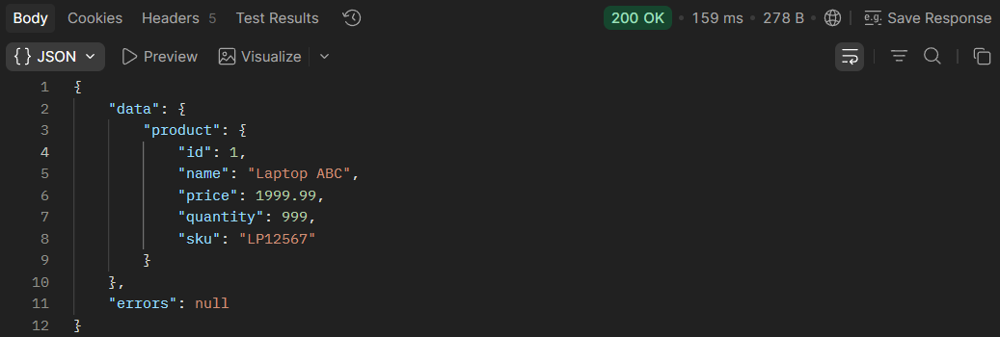
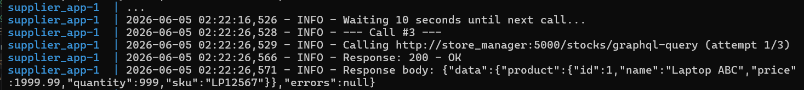
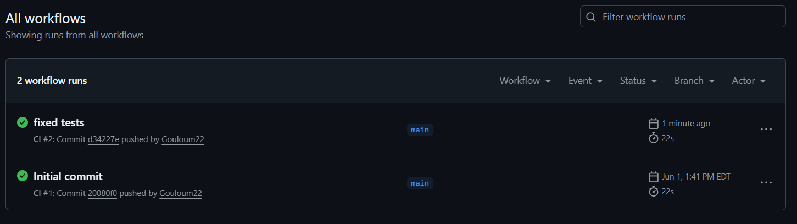

Dyaa Abou Arida

# Rapport Labo 3

**Question 1 : Dans la RFC 7231, nous trouvons que certaines méthodes HTTP sont considérées comme sûres (safe) ou idempotentes, en fonction de leur capacité à modifier (ou non) l'état de l'application. Lisez les sections 4.2.1 et 4.2.2 de la RFC 7231 et répondez : parmi les méthodes mentionnées dans l'activité 2, lesquelles sont sûres, non sûres, idempotentes et/ou non idempotentes?**

- Création d’un article : POST /products n'est pas sûre et n'est pas idempotente parce quelle peut créer plusieurs articles.

- Ajout de stock: POST /stocks n'est pas sûre et n'est pas idempotente parce que le stock peut changer plusieurs fois.

- Vérification du stock : GET /stocks/{product_id} est sûre et idempotente parce qu'elle ne fait que lire le stock.

- Création d’une commande : POST /orders n'est pas sûre et n'est pas idempotente parce que plusieurs commandes peuvent être créées.

- Suppression d’une commande : DELETE /orders/{order_id} n'est pas sûre mais elle est idempotente parce qu'elle peut supprimer qu'un nombre limitée de fois.

---------------------------------------
**Question 2 : Décrivez l'utilisation de la méthode join dans ce cas. Utilisez les méthodes telles que décrites à Simple Relationship Joins et Joins to a Target with an ON Clause dans la documentation SQLAlchemy pour ajouter les colonnes demandées dans cette activité. Veuillez inclure le code pour illustrer votre réponse.**

La méthode join de SQLAlchemy permet de combiner les données de Stock et Product. La table Stock contient la quantité en stock et la table Product contient les informations de l’article. Le lien entre les deux tables se fait grâce à la clé étrangère de l'identifiant du produit.

Code pour joindre les produits:

    def get_stock_for_all_products():
        """Get stock quantity for all products"""
        session = get_sqlalchemy_session()
        results = session.query(
            Stock.product_id,
            Stock.quantity,
            Product.name,
            Product.sku,
            Product.price
        ).join(
            Product, Stock.product_id == Product.id
        ).all()
        stock_data = []
        for row in results:
            stock_data.append({
                'Article': row.product_id,
                'Numéro SKU': '',
                'Prix unitaire': 0,
                'Unités en stock': int(row.quantity),
            })
        
        return stock_data

---------------------------------------
**Question 3 : Quels résultats avez-vous obtenus en utilisant l’endpoint POST /stocks/graphql-query avec la requête suggérée ? Veuillez joindre la sortie de votre requête dans Postman afin d’illustrer votre réponse.**

Le résultat obtenu est l'id du produit et la quantité.

Requête dans Postman:

Sortie de la requête:

---------------------------------------
**Question 4 : Quelles lignes avez-vous changé dans update_stock_redis? Veuillez joindre du code afin d’illustrer votre réponse.**

Les lignes modifiées dans update_stock_redis permettent d'enregistrer plus d'informations tel que le nom du produit, le prix et le sku. Alors, le mapping et le hset ont été modifiés.

Code du update_stock_redis:

    def update_stock_redis(order_items, operation):
        """ Update stock quantities in Redis """
        if not order_items:
            return

        r = get_redis_conn()
        stock_keys = list(r.scan_iter("stock:*"))

        if stock_keys:
            pipeline = r.pipeline()
            session = get_sqlalchemy_session()

            try:
                for item in order_items:
                    if hasattr(item, 'product_id'):
                        product_id = item.product_id
                        quantity = item.quantity
                    else:
                        product_id = item['product_id']
                        quantity = item['quantity']

                    current_stock = r.hget(f"stock:{product_id}", "quantity")
                    current_stock = int(current_stock) if current_stock else 0

                    if operation == '+':
                        new_quantity = current_stock + quantity
                    else:
                        new_quantity = current_stock - quantity

                    product_info = session.execute(
                        text("""
                            SELECT 
                                name,
                                sku,
                                price
                            FROM products
                            WHERE id = :pid
                        """),
                        {"pid": product_id}
                    ).mappings().fetchone()

                    if product_info:
                        pipeline.hset(
                            f"stock:{product_id}",
                            mapping={
                                "quantity": int(new_quantity),
                                "name": product_info["name"],
                                "sku": product_info["sku"],
                                "price": float(product_info["price"])
                            }
                        )
                    else:
                        pipeline.hset(
                            f"stock:{product_id}",
                            mapping={
                                "quantity": int(new_quantity)
                            }
                        )

                pipeline.execute()

            finally:
                session.close()

        else:
            _populate_redis_from_mysql(r)

---------------------------------------
**Question 5 : Quels résultats avez-vous obtenus en utilisant l’endpoint POST /stocks/graphql-query avec les améliorations ? Veuillez joindre la sortie de votre requête dans Postman afin d’illustrer votre réponse.**

La sortie modifiée permet d'avoir le nom, le prix et le sku d'un produit. L'id et la quantitée sont encore récupérés.

Requête dans Postman:

Sortie de la requête:

---------------------------------------

**Question 6** : Examinez attentivement le fichier docker-compose.yml du répertoire scripts, ainsi que celui situé à la racine du projet. Qu’ont-ils en commun ? Par quel mécanisme ces conteneurs peuvent-ils communiquer entre eux ? Veuillez joindre du code YML afin d’illustrer votre réponse.

Les deux fichiers utilisent le même réseau Docker lab03-network. Ce réseau permet aux conteneurs de communiquer entre eux. Le mécanisme utilisé est le Docker partagé qui permet de se contacter grâce au nom de service.

Code YAML du supplier:

    services:
    supplier_app:
        build: .
        environment:
        - PYTHONUNBUFFERED=1
        volumes:
        - .:/app
        networks:
        - labo03-network

    networks:
    labo03-network:
        driver: bridge
        external: true

code YAML du store_manager:

    services:
    store_manager:
        build: .
        environment:
        - PYTHONUNBUFFERED=1
        volumes:
        - .:/app
        ports:
        - "5000:5000"
        networks:
        - labo03-network
        depends_on:
        mysql:
            condition: service_healthy
        redis:
            condition: service_healthy

    networks:
    labo03-network:
        driver: bridge
        external: true

Sortie de la requête:

## CI/CD

Intégration continue avec les tests: 

Déploiement continue sur la VM:

